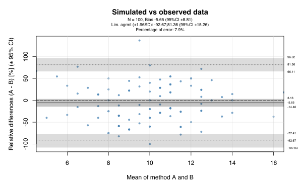

# Bland-Altman

## Description

Bland-Altman analysis and plot

 - Bias (mean of the differences) and 95% confidence interval
 - Limits of agreement (± 1.96 by default) with their 95% confidence interval
 - Relative or absolute difference
 - Validation of the normality of the differences (Shapiro-Wilk)
 - Percentage of error
 - No dependencies


## To install GitHub R packages:

```R
# Only the first time or to upgrade:
install.packages("devtools")
library(devtools)
install_github("sauthiem/BlandAltman")

# Every time before use
library(BlandAltman)
```


## Example:

```R
# Any numerical vector. x and y have to be the same length.
a <- rpois(100, 10)
b <- rpois(100, 10)

# Plot
BA.plot(a, b, title="Simulated vs observed data", percent=T, reference="mean", conf.int=0.95)

# Numbers
ba <- BA.analysis(a, b, percent=F)
str(ba)

```



```
List of 16
 $ x                         : num [1:100] 10.5 10 9 10 9.5 12.5 8.5 8.5 14 12.5 ...
 $ y                         : num [1:100] -3 -6 2 8 5 -9 -5 -3 2 -3 ...
 $ bias                      : num -0.54
 $ bias.ci                   : num 0.867
 $ bias.ci.lower             : num -1.41
 $ bias.ci.upper             : num 0.327
 $ limit.agrmt.ci            : num 1.5
 $ limit.agrmt.upper         : num 8.03
 $ limit.agrmt.upper.ci.upper: num 9.53
 $ limit.agrmt.upper.ci.lower: num 6.52
 $ limit.agrmt.lower         : num -9.11
 $ limit.agrmt.lower.ci.upper: num -7.6
 $ limit.agrmt.lower.ci.lower: num -10.6
 $ percentage.error          : num 8.1
 $ n                         : int 100
 $ conf.int                  : num 0.95
```

## Parameters

- title: Title of the plot
- percent: relative estimation of the differences (default F)
- reference: X axis (method A, B or mean) (default "mean")
- conf.int: confidence interval of both limits of agreements and all uncertainties (default 0.95 (~ ±1.96)

## List returned elements:

- x
- y
- bias
- bias.ci
- bias.ci.lower
- bias.ci.upper
- limit.agrmt.ci
- limit.agrmt.upper
- limit.agrmt.upper.ci.upper
- limit.agrmt.upper.ci.lower
- limit.agrmt.lower
- limit.agrmt.lower.ci.upper
- limit.agrmt.lower.ci.lower
- percentage.error
- n
- conf.int


## References:

1) Bland, J.M. & Altman, D.G., 1986. *Statistical methods for assessing agreement between two methods of clinical measurement*. **Lancet**, 1(8476), pp.307–310.
2) Giavarina, D., 2015. *Understanding Bland Altman analysis*. **Biochemia Medica**, 25(2), pp.141–151
